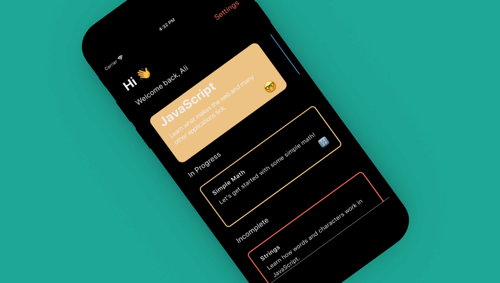

<h1 align="center">Cursor</h1>

<p align="center">Learning with no barriers.</p>

<p align="center">
 
  
</p>

<p align="center">
  
</p>

Learning to code should be easy, fun and especially free! Cursor is here to solve just that. Learn JavaScript, Python (Coming soon!) and much more. Courses are short, sweet and to the point, requiring no prior knowledge to get started.

- No sign up required
- No data tracking
- Always free, never a paid tier
- Learn at your own pace
- New courses every week

# Getting Started

To get started, clone the repo and install all the dependencies like the following:

```
git clone git@github.com:awaseem/cursor.git
cd cursor && npm install
```

## Running the app

To run the app, just use the following command:

```
npm start
```

This will open the Expo portal, from there scan the QR code and the app should lode with no issues.

## Testing

To run tests, simply run the following command:

```
npm run test
```

# Data

All the data lives within a separate repo called [Teacher](https://github.com/awaseem/teacher). The app in development mode takes to the default dev environment here [teacher-dev.getcursor.app](https://teacher-dev.getcursor.app/). If you need to make changes to the content itself, follow the contribution guide within that repo.

# Contributing

Cursor is an open source project, and contributions of any kind are welcome and appreciated. Open issues, bugs, and feature requests are all listed on the issues tab and labeled accordingly. Feel free to open bug tickets and make feature requests. Please follow these small rules to ensure everything can produced smoothly, can't wait to see your work!

- When submitting work, please ensure to create a pull request with pictures or videos showcasing the changes to the app.
- Ensure to run the linter and eslint within you text editor

Have fun and don't be afraid to reach out for any questions or concerns.

# License

This project is open source and available under the MIT License.
